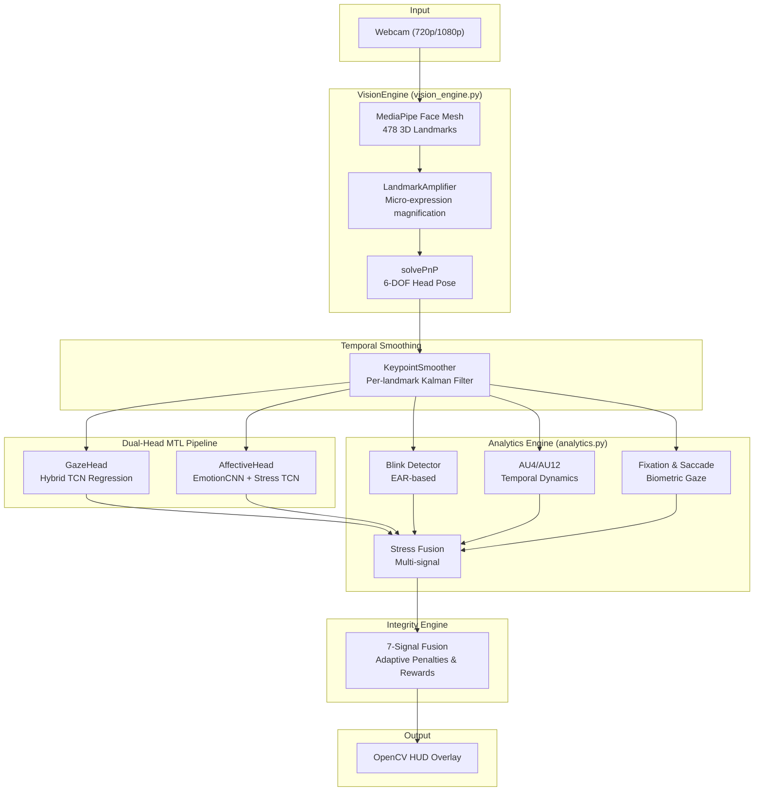
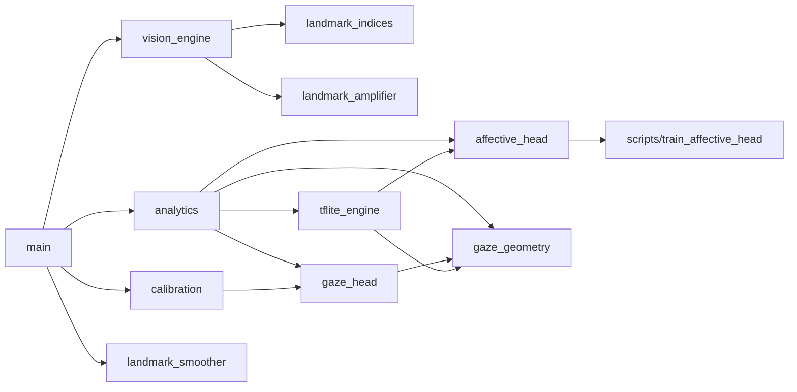
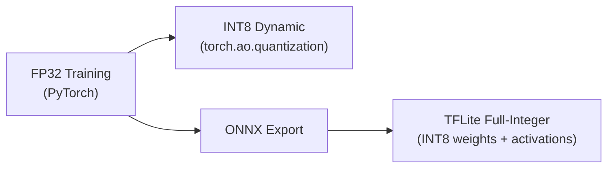

# Architecture

Sentin-Edge AI is a **privacy-first, edge-deployed** system for real-time gaze tracking, affective state estimation, and behavioral integrity scoring. All processing runs on-device using the local CPU — no frames leave the machine.

## High-Level Architecture

## Module Dependency Graph

## Design Principles

### Privacy-First Architecture
- **No frame persistence**: All video frames are processed in-memory and immediately discarded.
- **Edge-only inference**: Models run locally via PyTorch (INT8 dynamic quantization) or TFLite (full integer quantization).
- **No network calls**: The application never transmits data externally.

### Dual-Head Multi-Task Learning
The system runs two classification heads simultaneously on every frame:

| Head | Input | Model | Output |
|------|-------|-------|--------|
| **Gaze Head** | 10-D weighted iris geometry + 6-DOF pose | MLP → TCN → Regressor | Screen (x, y) + categorical label |
| **Affective Head** | 48×48 grayscale face crop + 12-D temporal geometry | EmotionCNN (256-D embed) → Stress TCN | Emotion label + stress score (0-1) |

### Multi-Signal Integrity Engine
The Integrity Engine fuses **7 independent signals** into a single 0-100 score:

1. **Gaze direction** — on-screen vs off-screen
2. **Stress level** — continuous CNN+TCN score
3. **Fixation duration** — gaze stability indicator
4. **Saccade rate** — gaze instability indicator
5. **AU micro-expression spikes** — temporal velocity/acceleration
6. **Micro-tremor** — somatic stress marker (eyebrow Y-variance)
7. **Blink-rate distress** — autonomic stress marker vs calibrated baseline

Penalties compound when multiple signals fire simultaneously; recovery rewards scale when no distress signals are active.

## Quantization Strategy

- **Development**: FP32 PyTorch models for training and experimentation
- **CPU Optimized**: INT8 dynamic quantization (`.pth`) for PyTorch runtime
- **Edge Deployment**: Full-integer TFLite (`.tflite`) for maximum CPU throughput
