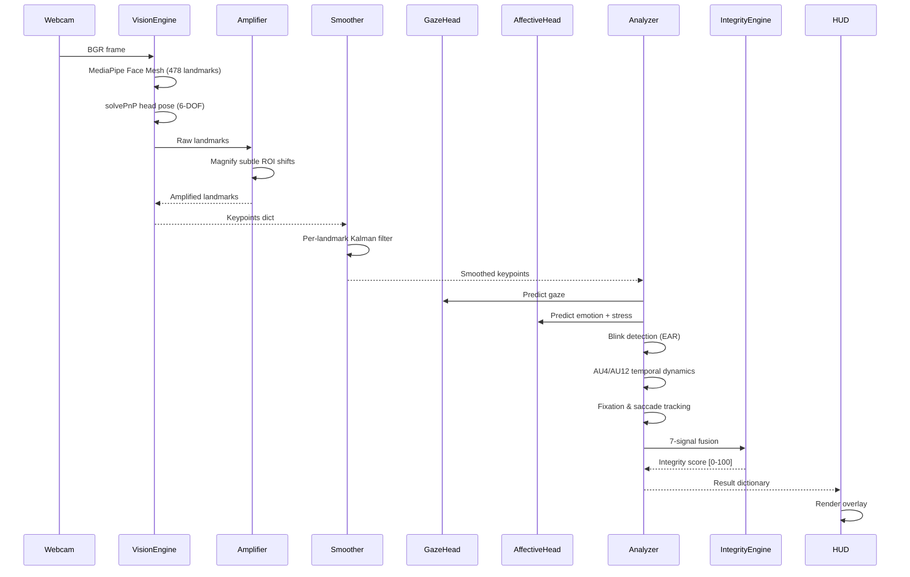

# Frame Processing Pipeline

A detailed walkthrough of how a single webcam frame flows through the Sentin-Edge AI pipeline — from raw pixels to the final integrity score.

---

## Pipeline Overview



---

## Step-by-Step Walkthrough

### Step 1: Frame Capture (`main.py`)

```python
cap = cv2.VideoCapture(0)
ret, frame = cap.read()
```

The webcam provides a BGR frame (typically 640×480 or 1280×720). The frame is **never written to disk**.

### Step 2: Landmark Extraction (`vision_engine.py`)

```python
kp = engine.process(frame)
```

1. Convert BGR → RGB for MediaPipe
2. Run MediaPipe Face Mesh (refine_landmarks=True for iris tracking)
3. Convert normalised landmarks to pixel coordinates: `(x, y) = (lm.x * w, lm.y * h)`
4. Pass through **LandmarkAmplifier** to magnify subtle ROI shifts
5. Extract named keypoints (iris centres, eye corners, eyebrows, etc.)
6. Compute 6-DOF head pose via `cv2.solvePnP()` using 6 canonical face points

### Step 3: Temporal Smoothing (`landmark_smoother.py`)

```python
kp = smoother.smooth(kp)
```

Each tracked keypoint (iris, corners, eyelids, eyebrows) passes through an independent **1D Kalman filter** with a constant-velocity model. This removes high-frequency webcam jitter while preserving genuine eye/brow movements.

- **State vector:** `[position, velocity]`
- **Process noise:** 1e-3 (allows small position jumps)
- **Measurement noise:** 0.08 (accounts for webcam noise)

When face tracking is lost (`kp is None`), all filters are reset to avoid stale velocity estimates.

### Step 4: Gaze Classification (`gaze_head.py`)

```python
gaze_label, gaze_vals = gaze_head.predict(keypoints, frame)
```

1. **Geometric ratios:** Project each iris centre onto the inner→outer eye corner segment. The ratio `t` indicates horizontal gaze position (0 = inner corner, 1 = outer corner).
2. **Head-pose compensation:** Adjust ratios using `compensate_head_pose()` to prevent false off-screen alerts during head rotation.
3. **Categorical label:** Derived from the mean ratio:
   - `t < 0.35` → Left
   - `0.35 ≤ t ≤ 0.65` → Center
   - `t > 0.65` → Right
   - Outside `[-0.15, 1.15]` → Off-screen
4. **ML regression:** The 10-D weighted feature vector is fed through a temporal sequence (padded to 15 frames) → MLP → TCN → head-pose fusion → `(screen_x, screen_y)` in [0, 1].

### Step 5: Emotion & Stress Detection (`affective_head.py`)

```python
emotion, level, stress_score = affective_head.predict(kp, frame, temporal)
```

1. **Face crop extraction:** Crop and pad the face from the frame using `face_bbox`, resize to 48×48 grayscale.
2. **EmotionCNN forward pass:** Extract a 256-D embedding and 7-class emotion probabilities (angry, disgust, fear, happy, neutral, sad, surprise).
3. **Temporal geometry vector (12-D):** Concatenate the CNN embedding with temporal cues: `[delta_brow, blink_state, micro_tremor, blink_z, pitch, yaw, roll, au4_vel, au4_acc, au12_vel, au12_acc, spike]`
4. **Stress TCN:** Feed a 15-frame sequence of these 268-D (256+12) vectors through a dilated TCN → sigmoid → stress score in [0, 1].

### Step 6: Blink Detection

Uses the **Eye Aspect Ratio (EAR)** method:

```
EAR = (||p2 - p6|| + ||p3 - p5||) / (2 * ||p1 - p4||)
```

- A blink is detected when median EAR drops below the calibrated threshold (default: 0.7× baseline)
- Blink suppress frames (4 frames) prevent stress score contamination during blinks
- Blink rate (BPM) is computed from a 900-frame ring buffer
- After calibration, a baseline μ/σ is established; deviation > 1.5σ triggers distress

### Step 7: AU Temporal Dynamics

Action Unit 4 (Brow Lowerer) and AU12 (Lip Corner Puller) activations are tracked in 20-frame rolling buffers:

1. **Velocity** = `activation[t] - activation[t-1]`
2. **Acceleration** = `velocity[t] - velocity[t-1]`
3. **Stress Spike** = AU4 velocity > 0.08 AND acceleration > 0.04 (with 10-frame cooldown)

### Step 8: Fixation & Saccade Tracking

- **Fixation:** Consecutive frames where gaze variance stays below threshold (0.08). Duration in ms = frames × (1000/30).
- **Saccade:** Frame where gaze velocity > 0.12 AND the gaze zone label changes. Rate = saccades/sec in a 2-second window.

### Step 9: Integrity Scoring (`compute_integrity()`)

The integrity engine applies 7 layers of adaptive penalties and rewards:

| Layer | Signal | Effect |
|-------|--------|--------|
| 1 | Base decay | -0.015 per frame |
| 2 | Stress score | -score × 2.0 |
| 3 | Off-screen gaze | -5.0 (+ -12.0 combo with high stress) |
| 4 | Short fixation | -0.5 × deficit ratio |
| 5 | AU spikes | -2.0 per spike |
| 6 | Micro-tremor / blink distress | -1.5 / -1.0 |
| 7 | Recovery | +4.0 (center, calm) or +1.5 (on-screen) |

The raw score is then EMA-smoothed with α=0.06 for temporal stability.

### Step 10: HUD Rendering (`draw_overlay()`)

The result dictionary is rendered onto the frame:
- Gaze direction and ratios
- Head pose (Pitch/Yaw/Roll)
- Emotion label
- Stress level and score
- Blink rate, micro-tremor, AU velocities
- Stress spike detection
- Fixation duration, saccade rate
- Distress flag
- Integrity score (color-coded: green > 70, yellow > 40, red ≤ 40)
- FPS counter
- Environment quality meter (brightness + blur)
- Confidence heatmap circle
- Eye mesh contour overlays (polylines for eye and iris)

---

## Calibration Phase

When the user presses **`c`**, the `CalibrationEngine` takes over the display:

1. Shows a neutral grey screen with a pulsing red dot
2. Cycles through 5 positions: Center → TopLeft → TopRight → BottomLeft → BottomRight
3. Each position is held for 3 seconds (first 0.5s is settling time)
4. During each position, `gaze_head.fine_tune()` runs SGD to minimise MSE between predicted and known screen coordinates
5. On completion, weights are saved to `models/gaze_hybrid_epoch2.pth`
